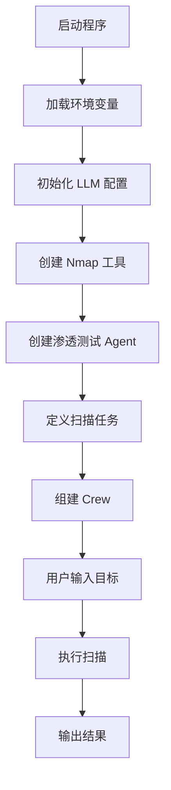

# Pentest Crew - 智能渗透测试自动化平台

<div align="center">


**基于五层架构的智能渗透测试自动化平台，利用 CrewAI + LLM 实现自动化安全测试**

[快速开始](#-快速开始) · [API文档](#-api-使用指南) · [架构设计](#️-架构设计) · [配置说明](#-配置说明)

</div>

---

## 📖 项目简介

Pentest Crew 是一个企业级渗透测试自动化平台，通过 **CrewAI 框架** 编排多个专业化 AI Agent，实现从信息收集到报告生成的全流程自动化。

### ✨ 核心特性

- 🤖 **智能 Agent 协作** - 多个专业化 Agent 协同工作，模拟真实渗透测试流程
- 🔧 **工具标准化封装** - 统一封装 Nmap、SQLMap、Metasploit 等安全工具
- 🧠 **知识库驱动** - 向量数据库存储漏洞知识，支持 CVE 自动匹配
- 🔄 **状态机流程控制** - 可视化任务状态，支持暂停/恢复/回滚
- 🐳 **容器化部署** - Docker Compose 一键启动，隔离安全工具执行环境
- 📊 **多格式报告** - 支持 PDF、HTML、JSON、Markdown 格式报告导出

---

## 🏗️ 架构设计

采用五层架构设计，实现关注点分离和高内聚低耦合：

```
┌─────────────────────────────────────────────────────────────────────────┐
│                         Orchestration Layer                              │
│                    (CrewAI + FastAPI + Flow Control)                     │
│         ┌──────────────┐  ┌──────────────┐  ┌──────────────┐            │
│         │ CrewFactory  │  │TaskGenerator │  │FlowController│            │
│         └──────────────┘  └──────────────┘  └──────────────┘            │
├─────────────────────────────────────────────────────────────────────────┤
│                           Agent Layer                                    │
│    ┌───────────┐  ┌───────────┐  ┌───────────┐  ┌───────────┐          │
│    │ReconAgent │  │ExploitAgent│ │PrivAgent  │  │ReportAgent│          │
│    │ 信息收集   │  │ 漏洞利用   │  │ 权限提升  │  │ 报告生成  │          │
│    └───────────┘  └───────────┘  └───────────┘  └───────────┘          │
├─────────────────────────────────────────────────────────────────────────┤
│                           Tool Layer                                     │
│    ┌───────────┐  ┌───────────┐  ┌───────────┐  ┌───────────┐          │
│    │NmapWrapper│  │SQLMapWrap │  │MSFWrapper │  │ CustomPOC │          │
│    └───────────┘  └───────────┘  └───────────┘  └───────────┘          │
├─────────────────────────────────────────────────────────────────────────┤
│                         Knowledge Layer                                  │
│    ┌──────────────┐  ┌──────────────┐  ┌──────────────┐                │
│    │  VectorStore │  │  CVEFetcher  │  │  AttackGraph │                │
│    │   向量数据库   │  │  CVE信息获取  │  │  攻击路径图   │                │
│    └──────────────┘  └──────────────┘  └──────────────┘                │
├─────────────────────────────────────────────────────────────────────────┤
│                       Infrastructure Layer                               │
│    ┌──────────┐  ┌──────────┐  ┌──────────┐  ┌──────────┐              │
│    │  Docker  │  │  Redis   │  │ ChromaDB │  │  Neo4j   │              │
│    │ 容器沙箱  │  │ 任务队列  │  │ 向量存储  │  │ 图数据库  │              │
│    └──────────┘  └──────────┘  └──────────┘  └──────────┘              │
└─────────────────────────────────────────────────────────────────────────┘
```

### 层级职责

| 层级 | 组件 | 职责 |
|------|------|------|
| **Orchestration** | CrewFactory, TaskGenerator, FlowController | 任务编排、状态管理、流程控制 |
| **Agent** | ReconAgent, ExploitAgent, PrivilegeAgent, ReportAgent | 执行具体渗透测试任务 |
| **Tool** | NmapWrapper, SQLMapWrapper, CustomPOC | 封装安全工具，标准化接口 |
| **Knowledge** | VectorStore, CVEFetcher, AttackGraph | 知识存储、漏洞匹配、攻击路径规划 |
| **Infrastructure** | Docker, Redis, ChromaDB | 容器化执行、任务队列、数据持久化 |

---

## 📁 目录结构

```
pentest-crew/
├── 📂 src/                          # 源代码目录
│   ├── 📂 core/                     # 核心接口层
│   │   ├── agent_interface.py       # Agent 抽象基类
│   │   ├── tool_interface.py        # Tool 抽象基类
│   │   ├── knowledge_interface.py   # Knowledge 抽象基类
│   │   └── task_interface.py        # Task 抽象基类
│   │
│   ├── 📂 agents/                   # Agent 实现层
│   │   ├── recon_agent.py           # 信息收集 Agent
│   │   ├── exploit_agent.py         # 漏洞利用 Agent
│   │   ├── privilege_agent.py       # 权限提升 Agent
│   │   └── report_agent.py          # 报告生成 Agent
│   │
│   ├── 📂 tools/                    # 工具封装层
│   │   ├── nmap_wrapper.py          # Nmap 扫描封装
│   │   ├── sqlmap_wrapper.py        # SQLMap 注入封装
│   │   └── custom_poc.py            # 自定义 POC 框架
│   │
│   ├── 📂 knowledge/                # 知识管理层
│   │   ├── vector_store.py          # 向量数据库存储
│   │   ├── cve_fetcher.py           # CVE 信息获取
│   │   └── attack_graph.py          # 攻击路径图
│   │
│   ├── 📂 orchestration/            # 编排调度层
│   │   ├── crew_factory.py          # CrewAI 工厂
│   │   ├── task_generator.py        # 任务生成器
│   │   └── flow_controller.py       # 流程控制器
│   │
│   ├── 📂 api/                      # API 接口层
│   │   ├── main.py                  # FastAPI 入口
│   │   ├── 📂 routes/               # API 路由
│   │   │   ├── scan.py              # 扫描管理 API
│   │   │   ├── task.py              # 任务管理 API
│   │   │   └── report.py            # 报告管理 API
│   │   └── 📂 models/               # 数据模型
│   │       └── schemas.py           # Pydantic 模型
│   │
│   └── 📂 utils/                    # 工具函数层
│       ├── docker_sandbox.py        # Docker 沙箱
│       └── logger.py                # 日志配置
│
├── 📂 config/                       # 配置文件目录
│   ├── agents.yaml                  # Agent 配置
│   ├── tools.yaml                   # 工具配置
│   └── attack_patterns.yaml         # 攻击模式配置
│
├── 📂 docker/                       # Docker 配置目录
│   ├── Dockerfile.api               # API 服务镜像
│   ├── Dockerfile.worker            # Worker 服务镜像
│   └── docker-compose.yml           # 容器编排配置
│
├── 📂 tests/                        # 测试文件目录
│   ├── conftest.py                  # 测试配置
│   └── 📂 test_core/                # 核心模块测试
│
├── 📂 scripts/                      # 脚本文件目录
│   └── entrypoint.sh                # 入口脚本
│
├── .env.example                     # 环境变量模板
├── requirements.txt                 # Python 依赖
└── README.md                        # 项目文档
```

---

## 🚀 快速开始

### 前置要求

- [Docker](https://www.docker.com/) 20.10+
- [Docker Compose](https://docs.docker.com/compose/) 2.0+
- (可选) Python 3.11+ 用于本地开发

### 1️⃣ 获取项目

```bash
# 克隆项目
git clone https://github.com/your-org/pentest-crew.git
cd pentest-crew
```

### 2️⃣ 配置环境变量

```bash
# 复制环境变量模板
cp .env.example .env

# 编辑配置文件（必须配置 LLM API 密钥）
vim .env
```

**关键配置项：**

```bash
# LLM 配置（必填）
LLM_PROVIDER=openai
OPENAI_API_KEY=your-api-key-here
OPENAI_MODEL=gpt-4

# 或使用 OpenRouter
LLM_PROVIDER=openrouter
OPENROUTER_API_KEY=your-openrouter-key
OPENROUTER_MODEL=deepseek/deepseek-v3.2
```

### 3️⃣ 启动服务

```bash
# 使用 Docker Compose 启动所有服务
docker-compose -f docker/docker-compose.yml up -d

# 查看服务状态
docker-compose -f docker/docker-compose.yml ps

# 查看日志
docker-compose -f docker/docker-compose.yml logs -f api
```

### 4️⃣ 验证服务

```bash
# 健康检查
curl http://localhost:8000/health

# 访问 API 文档
# 浏览器打开: http://localhost:8000/docs
```

---

## 🎯 使用示例

### 场景：对目标进行完整渗透测试

#### 方式一：通过 Swagger UI（推荐新手）

1. 打开 http://localhost:8000/docs
2. 找到 `POST /api/v1/scan/start` 端点
3. 点击 "Try it out"
4. 输入请求参数：

```json
{
  "target": "192.168.1.100",
  "scan_type": "full",
  "scope": ["192.168.1.0/24"],
  "options": {
    "nmap_profile": "full",
    "enable_exploit": true
  }
}
```

5. 点击 "Execute" 执行

#### 方式二：通过 cURL

```bash
# 1. 启动扫描
curl -X POST "http://localhost:8000/api/v1/scan/start" \
  -H "Content-Type: application/json" \
  -d '{
    "target": "192.168.1.100",
    "scan_type": "full",
    "options": {"nmap_profile": "full"}
  }'

# 返回: {"scan_id": "abc-123", "status": "pending", ...}

# 2. 查看扫描进度
curl "http://localhost:8000/api/v1/scan/abc-123"

# 3. 查看任务列表
curl "http://localhost:8000/api/v1/task/"

# 4. 生成报告
curl -X POST "http://localhost:8000/api/v1/report/generate" \
  -H "Content-Type: application/json" \
  -d '{"scan_id": "abc-123", "format": "pdf"}'

# 5. 下载报告
curl "http://localhost:8000/api/v1/report/{report_id}/download?format=pdf" \
  -o pentest_report.pdf
```

#### 方式三：通过 PowerShell

```powershell
# 启动扫描
$body = @{
    target = "192.168.1.100"
    scan_type = "full"
    scope = @("192.168.1.0/24")
    options = @{
        nmap_profile = "full"
        enable_exploit = $true
    }
} | ConvertTo-Json -Depth 3

$response = Invoke-RestMethod `
  -Uri "http://localhost:8000/api/v1/scan/start" `
  -Method POST `
  -ContentType "application/json" `
  -Body $body

$scanId = $response.scan_id

# 查看进度
Invoke-RestMethod -Uri "http://localhost:8000/api/v1/scan/$scanId"

# 生成报告
$reportBody = @{
    scan_id = $scanId
    format = "pdf"
    language = "zh-CN"
} | ConvertTo-Json

$report = Invoke-RestMethod `
  -Uri "http://localhost:8000/api/v1/report/generate" `
  -Method POST `
  -ContentType "application/json" `
  -Body $reportBody

# 下载报告
Invoke-WebRequest `
  -Uri "http://localhost:8000/api/v1/report/$($report.report_id)/download?format=pdf" `
  -OutFile "pentest_report.pdf"
```

---

## 📚 核心组件

### Agent 层

| Agent | 职责 | 输入 | 输出 |
|-------|------|------|------|
| **ReconAgent** | 信息收集、端口扫描、服务识别 | 目标地址 | 开放端口、服务版本、技术栈 |
| **ExploitAgent** | 漏洞验证、漏洞利用 | Recon 结果 | 漏洞利用结果、Shell 访问 |
| **PrivilegeAgent** | 权限提升、持久化 | Exploit 结果 | 提权结果、持久化方法 |
| **ReportAgent** | 报告生成、结果汇总 | 所有 Agent 结果 | 渗透测试报告 |

### Tool 层

| Tool | 类别 | 风险等级 | 功能描述 |
|------|------|----------|----------|
| **NmapWrapper** | Scanner | 🟢 Low | 端口扫描、服务识别、OS 检测 |
| **SQLMapWrapper** | Exploit | 🟠 High | SQL 注入自动化利用 |
| **MetasploitWrapper** | Exploit | 🔴 Critical | 漏洞利用框架封装 |
| **CustomPOC** | Exploit | 🟡 Variable | 自定义 POC 执行框架 |

### Knowledge 层

| 组件 | 功能 | 技术栈 |
|------|------|--------|
| **VectorStore** | 漏洞知识库向量存储，支持语义搜索 | ChromaDB / Qdrant |
| **CVEFetcher** | 自动获取 CVE 详情、PoC、修复建议 | NVD API + CIRCL API |
| **AttackGraph** | 构建攻击路径图，可视化攻击链 | Neo4j 图数据库 |

---

## 🔧 配置说明

### 环境变量配置 (.env)

```bash
# ==================== LLM 配置 ====================
# 必填：选择 LLM 提供商
LLM_PROVIDER=openai  # 可选: openai, openrouter, ollama

# OpenAI 配置
OPENAI_API_KEY=sk-xxxxxxxxxxxxxxxx
OPENAI_MODEL=gpt-4-turbo-preview
OPENAI_BASE_URL=https://api.openai.com/v1  # 可选，用于代理

# OpenRouter 配置（替代 OpenAI）
# OPENROUTER_API_KEY=sk-or-xxxxxxxx
# OPENROUTER_MODEL=deepseek/deepseek-v3.2

# Ollama 本地模型配置
# OLLAMA_BASE_URL=http://localhost:11434
# OLLAMA_MODEL=llama2:70b

# ==================== 数据库配置 ====================
# Redis 配置
REDIS_URL=redis://redis:6379/0

# ChromaDB 配置
CHROMA_HOST=chromadb
CHROMA_PORT=8000

# Neo4j 配置（可选，用于攻击图）
NEO4J_URI=bolt://neo4j:7687
NEO4J_USER=neo4j
NEO4J_PASSWORD=your_password

# ==================== 工具配置 ====================
# Nmap 配置
NMAP_DOCKER_IMAGE=instrumentisto/nmap:latest
NMAP_TIMEOUT=300

# SQLMap 配置
SQLMAP_DOCKER_IMAGE=sqlmap/sqlmap:latest
SQLMAP_TIMEOUT=600

# Metasploit 配置
MSF_RPC_HOST=msfrpcd
MSF_RPC_PORT=55553
MSF_RPC_PASSWORD=your_msf_password

# ==================== 安全配置 ====================
# Docker 沙箱配置
SANDBOX_NETWORK_ISOLATION=true
SANDBOX_RESOURCE_LIMITS=true
SANDBOX_MAX_MEMORY=2G
SANDBOT_MAX_CPU=2

# API 安全
API_KEY_ENABLED=true
API_KEY=your-secure-api-key
RATE_LIMIT_ENABLED=true
RATE_LIMIT_PER_MINUTE=60

# ==================== 日志配置 ====================
LOG_LEVEL=INFO
LOG_FORMAT=json  # 可选: json, text
LOG_FILE=/var/log/pentest-crew/app.log
```

### Agent 配置 (config/agents.yaml)

```yaml
agents:
  recon_agent:
    name: "ReconAgent"
    role: "信息收集专家"
    goal: "全面收集目标系统的信息，识别潜在攻击面"
    backstory: |
      你是一名经验丰富的渗透测试专家，专注于信息收集阶段。
      你擅长使用各种工具和技术来发现目标的网络拓扑、开放端口、
      服务版本、技术栈等关键信息。
    
    tools:
      - nmap_wrapper
      - dns_enum
      - whois_lookup
    
    llm_config:
      temperature: 0.3
      max_tokens: 4000
    
    max_iterations: 10
    verbose: true

  exploit_agent:
    name: "ExploitAgent"
    role: "漏洞利用专家"
    goal: "验证并利用发现的漏洞，获取系统访问权限"
    backstory: |
      你是一名资深的漏洞利用专家，精通各种漏洞类型的利用技术。
      你能够根据 ReconAgent 提供的信息，选择合适的漏洞利用方法，
      并在安全可控的范围内进行漏洞验证和利用。
    
    tools:
      - sqlmap_wrapper
      - metasploit_wrapper
      - custom_poc
    
    llm_config:
      temperature: 0.2
      max_tokens: 4000
    
    max_iterations: 15
    verbose: true
    require_approval: true  # 高危操作需要人工确认

  privilege_agent:
    name: "PrivilegeAgent"
    role: "权限提升专家"
    goal: "提升系统权限，建立持久化访问"
    backstory: |
      你是一名权限提升专家，擅长发现和利用系统配置错误、
      内核漏洞、服务漏洞等来提升权限。你也精通各种持久化技术。
    
    tools:
      - linpeas
      - winpeas
      - metasploit_wrapper
    
    llm_config:
      temperature: 0.1
      max_tokens: 4000
    
    max_iterations: 10
    verbose: true
    require_approval: true

  report_agent:
    name: "ReportAgent"
    role: "报告生成专家"
    goal: "生成专业、详细的渗透测试报告"
    backstory: |
      你是一名专业的渗透测试报告撰写专家，能够将复杂的渗透测试结果
      转化为清晰、专业、易于理解的报告。你擅长风险评估和修复建议。
    
    tools:
      - report_generator
      - cve_fetcher
    
    llm_config:
      temperature: 0.5
      max_tokens: 8000
    
    max_iterations: 5
    verbose: true
```

### 工具配置 (config/tools.yaml)

```yaml
tools:
  nmap_wrapper:
    name: "NmapWrapper"
    category: "scanner"
    risk_level: "low"
    
    profiles:
      quick:
        args: "-T4 -F"
        timeout: 60
        description: "快速扫描，常用端口"
      
      default:
        args: "-T4 -p- --min-rate 1000"
        timeout: 300
        description: "默认扫描，全端口"
      
      full:
        args: "-T4 -p- -sV -sC -O -A"
        timeout: 600
        description: "完整扫描，包含版本检测和脚本"
      
      stealth:
        args: "-T2 -sS -f --data-length 50"
        timeout: 900
        description: "隐蔽扫描，规避检测"
    
    docker:
      image: "instrumentisto/nmap:latest"
      network: "bridge"
      capabilities: ["NET_ADMIN", "NET_RAW"]

  sqlmap_wrapper:
    name: "SQLMapWrapper"
    category: "exploit"
    risk_level: "high"
    
    profiles:
      default:
        args: "--batch --random-agent"
        timeout: 300
      
      aggressive:
        args: "--batch --random-agent --level=5 --risk=3"
        timeout: 600
      
      stealth:
        args: "--batch --random-agent --tor --check-tor"
        timeout: 900
    
    docker:
      image: "sqlmap/sqlmap:latest"
      network: "bridge"

  custom_poc:
    name: "CustomPOC"
    category: "exploit"
    risk_level: "variable"
    
    poc_registry:
      - id: "CVE-2021-44228"
        name: "Log4Shell"
        severity: "critical"
        tags: ["rce", "log4j"]
      
      - id: "CVE-2022-22965"
        name: "Spring4Shell"
        severity: "critical"
        tags: ["rce", "spring"]
    
    docker:
      image: "python:3.11-slim"
      network: "isolated"  # 隔离网络
```

### 攻击模式配置 (config/attack_patterns.yaml)

```yaml
attack_patterns:
  web_application:
    name: "Web 应用渗透测试"
    description: "针对 Web 应用的全面渗透测试流程"
    
    phases:
      - name: "信息收集"
        agent: "recon_agent"
        tasks:
          - "端口扫描"
          - "目录枚举"
          - "技术栈识别"
          - "WAF 检测"
      
      - name: "漏洞发现"
        agent: "recon_agent"
        tasks:
          - "SQL 注入检测"
          - "XSS 检测"
          - "文件包含检测"
          - "敏感信息泄露"
      
      - name: "漏洞利用"
        agent: "exploit_agent"
        tasks:
          - "漏洞验证"
          - "获取 Shell"
          - "数据库访问"
      
      - name: "权限提升"
        agent: "privilege_agent"
        tasks:
          - "系统信息收集"
          - "提权尝试"
          - "持久化"
      
      - name: "报告生成"
        agent: "report_agent"
        tasks:
          - "结果汇总"
          - "风险评估"
          - "修复建议"

  network_infrastructure:
    name: "网络基础设施渗透测试"
    description: "针对网络基础设施的渗透测试流程"
    
    phases:
      - name: "网络发现"
        agent: "recon_agent"
        tasks:
          - "主机发现"
          - "端口扫描"
          - "服务识别"
      
      - name: "漏洞扫描"
        agent: "recon_agent"
        tasks:
          - "已知漏洞扫描"
          - "配置审计"
      
      - name: "漏洞利用"
        agent: "exploit_agent"
        tasks:
          - "服务漏洞利用"
          - "网络设备渗透"
```

---

## 🌐 API 使用指南

### API 端点总览

| 端点 | 方法 | 描述 |
|------|------|------|
| `/health` | GET | 健康检查 |
| `/api/v1/scan/start` | POST | 启动扫描任务 |
| `/api/v1/scan/{scan_id}` | GET | 查询扫描状态 |
| `/api/v1/scan/{scan_id}/stop` | POST | 停止扫描 |
| `/api/v1/task/` | GET | 获取任务列表 |
| `/api/v1/task/{task_id}` | GET | 获取任务详情 |
| `/api/v1/report/generate` | POST | 生成报告 |
| `/api/v1/report/{report_id}` | GET | 获取报告信息 |
| `/api/v1/report/{report_id}/download` | GET | 下载报告 |

### 详细 API 文档

#### 1. 启动扫描

**请求：**
```http
POST /api/v1/scan/start
Content-Type: application/json
```

**请求体：**
```json
{
  "target": "192.168.1.100",           // 必填：目标地址
  "scan_type": "full",                  // 可选：quick | default | full | stealth
  "scope": ["192.168.1.0/24"],         // 可选：扫描范围
  "options": {
    "nmap_profile": "full",             // Nmap 扫描配置
    "enable_exploit": true,             // 是否启用漏洞利用
    "enable_privilege": false,          // 是否启用权限提升
    "timeout": 3600,                    // 超时时间（秒）
    "callback_url": "https://your-server/webhook"  // 完成回调
  }
}
```

**响应：**
```json
{
  "scan_id": "550e8400-e29b-41d4-a716-446655440000",
  "status": "pending",
  "target": "192.168.1.100",
  "created_at": "2024-01-15T10:30:00Z",
  "estimated_duration": 1800
}
```

#### 2. 查询扫描状态

**请求：**
```http
GET /api/v1/scan/{scan_id}
```

**响应：**
```json
{
  "scan_id": "550e8400-e29b-41d4-a716-446655440000",
  "status": "running",
  "progress": 45,
  "current_phase": "vulnerability_scan",
  "current_agent": "exploit_agent",
  "findings": {
    "hosts_discovered": 3,
    "ports_open": 15,
    "vulnerabilities": 2,
    "critical": 1,
    "high": 1
  },
  "started_at": "2024-01-15T10:30:00Z",
  "estimated_completion": "2024-01-15T11:00:00Z"
}
```

#### 3. 生成报告

**请求：**
```http
POST /api/v1/report/generate
Content-Type: application/json
```

**请求体：**
```json
{
  "scan_id": "550e8400-e29b-41d4-a716-446655440000",
  "format": "pdf",           // pdf | html | json | markdown
  "language": "zh-CN",       // zh-CN | en-US
  "template": "enterprise",  // standard | enterprise | compliance
  "include_evidence": true,  // 是否包含证据截图
  "include_remediation": true // 是否包含修复建议
}
```

**响应：**
```json
{
  "report_id": "660e8400-e29b-41d4-a716-446655440000",
  "status": "generating",
  "format": "pdf",
  "estimated_size": "2.5 MB",
  "created_at": "2024-01-15T11:05:00Z"
}
```

---

## 🧪 测试指南

### 运行测试

```bash
# 运行所有测试
pytest tests/ -v

# 运行测试并生成覆盖率报告
pytest tests/ -v --cov=src --cov-report=html

# 运行特定测试文件
pytest tests/test_core/test_agent_interface.py -v

# 运行特定测试用例
pytest tests/test_core/test_agent_interface.py::TestBaseAgent -v

# 并行运行测试
pytest tests/ -v -n auto
```

### 测试结构

```
tests/
├── conftest.py              # 测试配置和 fixtures
├── test_core/               # 核心模块测试
│   ├── test_agent_interface.py
│   ├── test_tool_interface.py
│   └── test_knowledge_interface.py
├── test_agents/             # Agent 测试
│   ├── test_recon_agent.py
│   ├── test_exploit_agent.py
│   └── test_report_agent.py
├── test_tools/              # 工具测试
│   ├── test_nmap_wrapper.py
│   └── test_sqlmap_wrapper.py
└── test_api/                # API 测试
    ├── test_scan_routes.py
    └── test_report_routes.py
```

---

## 🛠️ 开发指南

### 本地开发环境设置

```bash
# 1. 创建虚拟环境
python -m venv venv
source venv/bin/activate  # Linux/macOS
# 或
.\venv\Scripts\activate  # Windows

# 2. 安装开发依赖
pip install -r requirements.txt
pip install -r requirements-dev.txt  # 包含 pytest, black, mypy 等

# 3. 安装 pre-commit hooks
pre-commit install

# 4. 启动开发服务
uvicorn src.api.main:app --reload --host 0.0.0.0 --port 8000
```

### 代码规范

```bash
# 代码格式化
black src/ tests/

# 类型检查
mypy src/

# 代码检查
ruff check src/

# 自动修复
ruff check --fix src/
```

### 添加新 Agent

1. 在 `src/agents/` 创建新 Agent 文件
2. 继承 `BaseAgent` 类
3. 实现 `execute()` 方法
4. 在 `config/agents.yaml` 添加配置
5. 编写测试用例

```python
# src/agents/custom_agent.py
from src.core.agent_interface import BaseAgent, AgentConfig

class CustomAgent(BaseAgent):
    def __init__(self, config: AgentConfig):
        super().__init__(config)
    
    async def execute(self, context: dict) -> dict:
        # 实现你的 Agent 逻辑
        return {"result": "success"}
```

### 添加新 Tool

1. 在 `src/tools/` 创建新 Tool 文件
2. 继承 `BaseTool` 类
3. 实现 `execute()` 和 `validate()` 方法
4. 在 `config/tools.yaml` 添加配置

```python
# src/tools/custom_tool.py
from src.core.tool_interface import BaseTool, ToolResult

class CustomTool(BaseTool):
    async def execute(self, params: dict) -> ToolResult:
        # 实现你的工具逻辑
        return ToolResult(
            success=True,
            output={"data": "result"},
            metadata={}
        )
```

---

## 🔒 安全注意事项

### ⚠️ 重要警告

1. **仅限授权使用** - 本工具仅可用于获得明确书面授权的系统
2. **法律合规** - 使用前请确保遵守当地法律法规
3. **数据保护** - 测试过程中可能涉及敏感数据，请妥善处理
4. **隔离环境** - 建议在隔离的测试环境中运行

### 安全最佳实践

- ✅ 始终获取书面授权后再进行测试
- ✅ 使用 Docker 沙箱隔离工具执行环境
- ✅ 启用 API 密钥认证和速率限制
- ✅ 定期审计日志和访问记录
- ✅ 对敏感操作启用人工确认机制
- ❌ 不要在生产环境中测试
- ❌ 不要对未授权目标进行扫描
- ❌ 不要泄露测试过程中获取的数据

---

## 🐛 故障排查

### 常见问题

**Q: Docker 容器启动失败**
```bash
# 检查 Docker 服务状态
docker info

# 查看容器日志
docker-compose -f docker/docker-compose.yml logs api

# 重新构建镜像
docker-compose -f docker/docker-compose.yml build --no-cache
```

**Q: LLM API 调用失败**
```bash
# 检查 API 密钥配置
echo $OPENAI_API_KEY

# 测试 API 连接
curl https://api.openai.com/v1/models \
  -H "Authorization: Bearer $OPENAI_API_KEY"
```

**Q: Redis 连接失败**
```bash
# 检查 Redis 服务
docker-compose -f docker/docker-compose.yml ps redis

# 测试 Redis 连接
docker exec -it pentest-crew-redis redis-cli ping
```

---

## 📄 许可证

本项目采用 MIT 许可证。详见 [LICENSE](LICENSE) 文件。

---

## ⚠️ 免责声明

**本工具仅供教育和授权安全测试使用。**

- 未经授权使用本工具进行渗透测试是**非法的**
- 使用者需遵守所在地区的法律法规
- 开发者不对任何滥用行为承担责任
- 使用本工具即表示您同意遵守以上条款

---

## 🤝 贡献指南

我们欢迎所有形式的贡献！

1. Fork 本仓库
2. 创建特性分支 (`git checkout -b feature/amazing-feature`)
3. 提交更改 (`git commit -m 'Add amazing feature'`)
4. 推送到分支 (`git push origin feature/amazing-feature`)
5. 创建 Pull Request

### 贡献类型

- 🐛 Bug 修复
- ✨ 新功能开发
- 📝 文档改进
- 🌐 翻译贡献
- 💡 建议和反馈

---

## 📞 联系方式

- **Issues**: [GitHub Issues](https://github.com/your-org/pentest-crew/issues)
- **Discussions**: [GitHub Discussions](https://github.com/your-org/pentest-crew/discussions)
- **Email**: security@example.com

---

<div align="center">

**Made with ❤️ by Pentest Crew Team**

**⭐ 如果这个项目对你有帮助，请给一个 Star！⭐**

</div>
- 安全评估

**配置参数**：
| 参数 | 值 | 说明 |
|------|-----|------|
| `verbose` | True | 启用详细日志 |
| `allow_delegation` | False | 禁止任务委托 |
| `max_iter` | 15 | 最大迭代次数 |

### 3. Nmap 扫描工具 (src/tools/nmap_tool.py)

**功能**：封装 Nmap 命令行工具，提供端口扫描能力

**输入参数**：
| 参数 | 类型 | 默认值 | 说明 |
|------|------|--------|------|
| `target` | str | 必需 | 目标 IP 或域名 |
| `options` | str | `-sV -O` | Nmap 扫描选项 |

**扫描模式**：
- `-F`：快速扫描（常用端口）
- `-sV`：服务版本检测

**超时设置**：60 秒

### 4. Docker 支持 (docker/Dockerfile)

**基础镜像**：`python:3.11-slim`

**预装工具**：
- Nmap 网络扫描工具

**构建命令**：
```bash
docker build -f docker/Dockerfile -t skidcon-minerva .
```

## 依赖项

| 包名 | 版本要求 | 用途 |
|------|----------|------|
| crewai | >=0.70.0 | AI Agent 框架 |
| crewai-tools | >=0.6.0 | Agent 工具库 |
| python-dotenv | >=1.0.0 | 环境变量管理 |
| litellm | >=1.0.0 | 统一 LLM API 调用 |

## 安装与运行

### 本地运行

1. **安装依赖**：
```bash
pip install -r requirements.txt
```

2. **安装 Nmap**：
- Windows: 从 https://nmap.org/download.html 下载安装
- Linux: `sudo apt install nmap`
- macOS: `brew install nmap`

3. **配置环境变量**：
创建 `.env` 文件：
```
OPENROUTER_API_KEY=your_api_key_here
OPENROUTER_MODEL=deepseek/deepseek-v3.2
```

4. **运行程序**：
```bash
python main.py
```

### Docker 运行

```bash
# 构建镜像
docker build -f docker/Dockerfile -t skidcon-minerva .

# 运行容器
docker run -it --rm skidcon-minerva
```

## 工作流程



## 安全注意事项

⚠️ **重要警告**：

1. **授权使用**：仅对您拥有授权的目标进行扫描
2. **法律合规**：未经授权的扫描可能违反法律
3. **默认目标**：程序默认使用 `scanme.nmap.org` 作为示例目标（Nmap 官方授权测试站点）
4. **API 密钥安全**：切勿将 `.env` 文件提交到版本控制系统

## 待完善功能

| 模块 | 状态 | 说明 |
|------|------|------|
| `config/agents.yaml` | 📝 空 | Agent 配置文件待实现 |
| `config/tasks.yaml` | 📝 空 | Task 配置文件待实现 |
| `src/crew/` | 📝 空 | Crew 编排逻辑待实现 |
| `src/tasks/` | 📝 空 | 独立任务模块待实现 |

## 代码质量评估

### 优点
- ✅ 清晰的模块化结构
- ✅ 使用 Pydantic 进行输入验证
- ✅ 完善的错误处理（超时、异常捕获）
- ✅ Docker 容器化支持
- ✅ 环境变量安全管理

### 改进建议
- 📌 完善 YAML 配置文件实现
- 📌 添加日志系统（logging 模块）
- 📌 增加单元测试
- 📌 添加更多安全工具（如 SQLMap, Nikto 等）
- 📌 实现扫描结果持久化存储
- 📌 添加报告生成功能

## 版本信息

- **Python**: 3.11+
- **CrewAI**: 0.70.0+
- **创建日期**: 2026年4月

## 许可证

请确保遵守相关法律法规和工具使用条款。

---

*本文档由代码审计自动生成*
